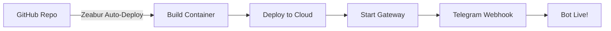

# 🚀 Clawdbot Cloud Migration - Status

**Letzte Aktualisierung:** 31. Januar 2026, 15:25 Uhr

---

## ✅ ABGESCHLOSSEN (Automatisch)

### Phase 1: Repository & Git Setup
- ✅ GitHub Repository erstellt: `samirballhausen-ship-it/clawdbot-cloud`
- ✅ URL: https://github.com/samirballhausen-ship-it/clawdbot-cloud
- ✅ Alle Workspace-Core-Dateien kopiert (AGENTS.md, SOUL.md, TOOLS.md, etc.)
- ✅ README.md erstellt

### Phase 2: Zeabur-Konfiguration
- ✅ `zbpack.json` - Zeabur Build-Config
- ✅ `package.json` - Node.js Dependencies
- ✅ `.gitignore` - Sensitive Dateien ausgeschlossen
- ✅ `.dockerignore` - Docker Build Optimierung

### Phase 3: Cloud-Config
- ✅ `clawdbot.json` für Cloud angepasst
- ✅ Alle API Keys durch Environment Variables ersetzt
- ✅ Gateway auf Production-Mode gesetzt
- ✅ Browser-Integration deaktiviert (optional später)

### Phase 4: Environment Variables
- ✅ `.env.example` Template erstellt
- ✅ `ZEABUR_ENV_VARS.txt` mit echten Keys (lokal, nicht in Git!)
- ✅ `DEPLOYMENT.md` mit allen Deployment-Infos

### Dokumentation
- ✅ `ZEABUR_SETUP_ANLEITUNG.md` - Vollständige Schritt-für-Schritt Anleitung
- ✅ `extract-anthropic-key.ps1` - PowerShell Script für API Key Extraktion
- ✅ Alle Dateien auf GitHub gepusht (ohne Secrets)

---

## 🔄 NÄCHSTE SCHRITTE (MANUELL)

Da der Bot keinen Browser-Zugriff hat, musst du die folgenden Schritte **selbst durchführen**:

### 📋 Quick-Start Checklist

1. **Öffne:** `ZEABUR_SETUP_ANLEITUNG.md`
2. **Folge den Phasen 5-13**
3. **Wichtigste Schritte:**
   - [ ] Zeabur Account Login (zeabur.com)
   - [ ] Project erstellen: "clawdbot-production"
   - [ ] GitHub Repo verbinden
   - [ ] Volumes erstellen (workspace, config)
   - [ ] Environment Variables setzen (aus `ZEABUR_ENV_VARS.txt`)
   - [ ] Deploy klicken
   - [ ] Telegram Webhook testen
   - [ ] Bei Erfolg: Lokales WSL2 stoppen

---

## 📁 Wichtige Dateien (Lokal)

**Im Repository-Verzeichnis:** `C:\clawdbot-cloud\`

| Datei | Zweck | Status |
|-------|-------|--------|
| `ZEABUR_SETUP_ANLEITUNG.md` | Vollständige Manual-Anleitung | ✅ Bereit |
| `ZEABUR_ENV_VARS.txt` | Echte API Keys (NICHT in Git!) | ✅ Lokal |
| `extract-anthropic-key.ps1` | ANTHROPIC_API_KEY extrahieren | ✅ Bereit |
| `DEPLOYMENT.md` | Deployment-Übersicht | ✅ Bereit |
| `.env.example` | Environment Variables Template | ✅ Bereit |

---

## 🔑 API Keys Übersicht

Alle API Keys findest du in:
- **`ZEABUR_ENV_VARS.txt`** (lokal, nicht in Git)
- ANTHROPIC_API_KEY: Extrahiere mit `extract-anthropic-key.ps1`

---

## 🎯 Deployment-Workflow



1. **Du pushst zu GitHub** → Zeabur baut automatisch
2. **Zeabur deployed** → Container startet
3. **Bot registriert Webhook** → Telegram verbindet sich
4. **24/7 Live!** → Lokales WSL2 kann gestoppt werden

---

## 📊 Geschätzte Zeit

**Bereits investiert:** ~30 Minuten (automatische Vorbereitung)

**Verbleibend (manuell):**
- Zeabur Setup: 10-15 Minuten
- Variables & Volumes: 10 Minuten
- Deployment & Test: 15 Minuten
- Cleanup: 5 Minuten

**Total verbleibend:** ~40-45 Minuten

---

## 💰 Kosten

**Zeabur Hobby Plan:** ~$5/Monat
- Dedicated Resources
- Persistent Volumes inklusive
- Unbegrenzter Traffic
- Auto-Deploy

**Alternative:** Free Tier (shared resources, 100GB Traffic)

---

## 🆘 Support

Bei Problemen:
1. Check `ZEABUR_SETUP_ANLEITUNG.md` → Troubleshooting Section
2. Zeabur Logs prüfen (Dashboard → Service → Logs)
3. Rollback möglich: Lokales WSL2 neu starten

**Rollback-Befehl:**
```bash
wsl systemctl --user start clawdbot-gateway.service
```

---

## 🎉 Nach erfolgreicher Migration

- ✅ Bot läuft 24/7 in der Cloud
- ✅ Keine Abhängigkeit vom lokalen PC
- ✅ Auto-Deploy bei Git Push
- ✅ Scalable & Reliable

**Dann kannst du:**
- Lokales WSL2 System deaktivieren
- Backup erstellen
- Optional: Browser-Integration später hinzufügen
- Optional: Custom Domain konfigurieren

---

**Status:** 🟡 Bereit für manuelle Deployment-Schritte

**Nächster Schritt:** Öffne `ZEABUR_SETUP_ANLEITUNG.md` und starte mit Phase 5!
